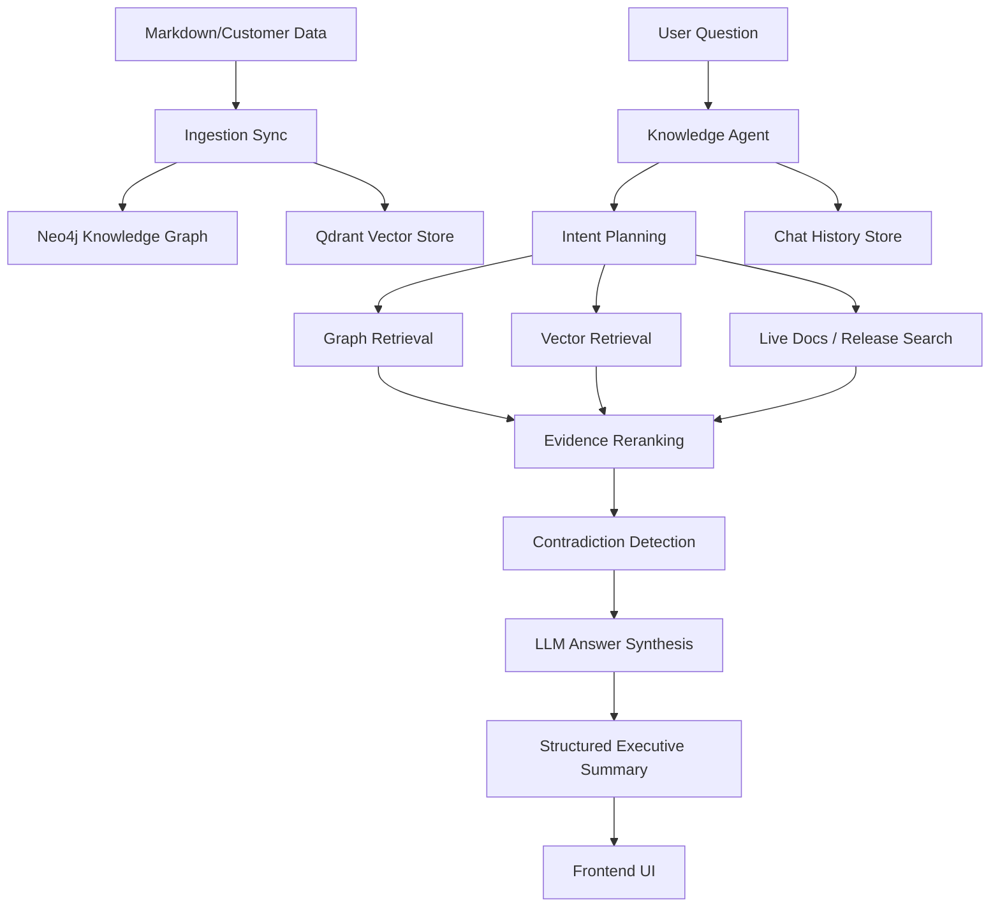

# Architecture Overview

This project is a grounded enterprise knowledge assistant designed for customer, product, and release intelligence. It ingests structured knowledge from markdown source datasets, stores it in a graph and vector store, retrieves relevant evidence across multiple sources, and synthesizes responses with explicit reasoning and evidence traces.

The system is built to answer operational questions such as:

- Which customers requested a feature?
- Is the request already supported or released?
- What does the product documentation say?
- What evidence supports the answer?
- Is there any contradiction between customer intent and live release information?

## 1. High-Level System Design

The app follows a GraphRAG + grounded reasoning architecture with four core layers:

1. Data ingestion layer
2. Knowledge storage layer
3. Retrieval and reasoning layer
4. User interaction and answer rendering layer

---

## 2. Core Components

### 2.1 Ingestion Layer

The ingestion pipeline reads customer knowledge from the dataset directory, including markdown records for accounts, issues, tasks, meeting notes, feature requests, and related operational material.

Main responsibilities:

- parse source markdown into normalized records
- assign stable record IDs
- detect change vs unchanged content
- upsert entities and relationships into Neo4j
- store chunk-level embeddings in Qdrant
- soft-delete records that are removed from the latest dataset

The ingestion logic is centered around:

- app/ingestion/parser.py
- app/ingestion/sync.py
- app/db/neo4j_store.py
- app/db/qdrant_store.py

This ensures the system is incremental and idempotent rather than reprocessing the whole corpus every time.

### 2.2 Knowledge Storage Layer

#### Neo4j

Neo4j stores the normalized graph relationships between customers, requirements, products, issues, tasks, and related entities. This enables:

- relationship-based reasoning
- entity expansion around a subject
- graph connectivity exploration
- analytical summaries over structured record data

#### Qdrant

Qdrant is the semantic retrieval store for chunk embeddings. It enables similarity search over large text content chunks and supports fast vector recall for natural-language questions.

#### Chat Memory Store

Conversation state is stored in a dedicated chat store. In this environment, the system attempts Postgres first but falls back cleanly to SQLite when the host cannot use libpq/psycopg reliably.

This design is deliberately resilient and is important for free-tier or constrained deployments because the user experience should not break just because a managed DB is unavailable.

---

## 3. Retrieval and Agent Pipeline

### 3.1 User Request Entry

A request enters the app through the FastAPI layer:

- /api/chat
- /api/graph
- /api/history/{conversation_id}
- /health

The UI sends the question, the optional conversation ID, and the system loads the current chat state.

### 3.2 Intent Planning

The orchestrator plans the query based on:

- source terms in the question
- whether the question is customer-led, docs-led, or release-led
- whether the question spans multiple sources
- prior conversation context

The orchestrator decides which sources to query:

- CUSTOMER_GRAPH
- LIVE_PRODUCT_DOCS
- LIVE_RELEASE_NOTES

This planning phase is critical because it avoids blindly searching every source for every query.

### 3.3 Tool Execution

The knowledge agent executes source-specific retrieval tools:

- GraphRAG retrieval for customer data and graph expansion
- live docs search for product documentation
- live release search for changelog and feature-release evidence

Each tool returns evidence items with metadata such as:

- title
- url
- record_id
- entity_type
- snippet
- score
- source type

### 3.4 Evidence Reranking and Deduplication

Before answer generation, the system reranks evidence using a lexical + score-based merge strategy. This helps keep the strongest evidence at the top and prevents duplicate records from dominating the final answer.

The result is a compact and high-signal evidence set for grounding.

### 3.5 Contradiction Detection

The agent checks for conflicts between:

- customer-requested status
- product documentation
- release notes

If a request appears to be marked as completed or in progress but live docs/release evidence suggest a different state, the system emits a contradiction or notice. This is a major explainability feature because it makes the agent transparent about uncertainty.

### 3.6 Grounded Answer Synthesis

The question, evidence, and contradictions are supplied to the LLM in a constrained JSON schema. The prompt instructs the model to:

- only answer from supplied evidence
- avoid speculation
- keep the answer concise and business-friendly
- return a structured executive summary
- include reasoning and follow-up questions if needed

This gives the final output a consistent format such as:

- Title
- Product Area
- Status
- Accounts Requesting
- Estimated Revenue Impact
- Summary

---

## 4. How the Agent Works

The agent is implemented in app/agent/orchestrator.py and acts as the orchestration brain.

### Main responsibilities

- create or reuse a conversation ID
- fetch context from memory
- decompose the user question into subqueries
- choose relevant retrieval sources
- collect evidence from each source
- rank and prune evidence
- detect contradictions
- call the LLM for grounded synthesis
- persist the conversation
- return structured JSON for the frontend

### Agent flow

1. User asks a question.
2. The system loads prior memory for the conversation.
3. A query plan is built based on intent and source terms.
4. The plan selects graph, docs, and/or release retrieval.
5. Evidence is gathered from each tool.
6. Contradiction checks run before final generation.
7. The LLM produces a grounded executive summary.
8. The answer is saved to memory and returned to the UI.

This is not a free-form chatbot. It behaves as a retrieval-and-grounding orchestration layer with evidence-aware output.

---

## 5. Explainability and Why It Matters

Explainability is one of the core design intentions of this system.

### Why this matters

In customer-facing or operations-heavy workflows, users do not just want an answer. They want to know:

- what the answer is based on
- which source it came from
- whether the result is partial or high-confidence
- whether there are contradictions or missing evidence
- why the system believes the answer is grounded

### Implemented explainability features

- evidence cards in the frontend
- source links in the API response
- retrieval steps list
- contradiction warnings
- reasoning summary
- confidence label and score
- structured answer sectioning

This directly addresses a common failure mode in AI systems: the model sounds confident but has no verifiable basis. This project intentionally avoids that by separating the answer from the evidence trail.

---

## 6. Frontend and User Experience

The frontend is a simple static app served by the FastAPI backend. It renders:

- chat input
- answer panel
- evidence cards
- retrieval steps
- contradictions panel
- conversation history
- graph visualization

This means the user experience is lightweight and easy to deploy, while still exposing operational transparency.

The frontend is intentionally built to support enterprise-style response readability, not just raw chatbot text. It turns structured answers into a clean table-like format for sales, support, and product teams.

---

## 7. Deployment Architecture

### Recommended deployment model for free-tier usage

For a low-cost setup, the most practical pattern is:

- Backend: FastAPI service on Render
- Frontend: static frontend either served from the same backend or hosted separately on Vercel
- Data services: Neo4j and Qdrant are the hardest part for free-tier deployment

### Why the backend is the natural first deploy target

The backend is the actual application brain:

- retrieval orchestration
- GraphRAG logic
- LLM grounding
- API exposure
- chat history abstraction

The user-facing UI is comparatively light and can be served in the same app or on Vercel if kept static.

### Free-tier constraints to keep in mind

1. Render free web services are good for API hosting but not ideal for always-on, large-memory graph/vector workloads.
2. Neo4j and Qdrant are not trivial to run in a fully free environment unless you use limited managed tiers or a small local dev environment.
3. SQLite is the safest fallback for chat history in restricted environments.
4. LLM providers such as Groq and Cohere often have rate limits; the app already contains graceful fallback behavior for this.
5. The app is designed to degrade cleanly when services are unavailable, which is important for free-tier or unreliable runtime environments.

### Best practical free-tier deployment pattern

#### Option A: single service on Render

- Deploy the FastAPI app as one web service on Render
- Serve the frontend from the same app via the static mount
- Use environment variables from .env or Render Secrets
- Keep SQLite fallback enabled for chat history
- Use a small local or managed Neo4j/Qdrant instance if available

This is the simplest route for this repo.

#### Option B: split frontend and backend

- Vercel for the static frontend
- Render for the API backend
- configure CORS and environment variables accordingly

This is cleaner for frontend hosting but slightly more setup.

---

## 8. Deployment-Specific Notes for This Project

### Required environment variables

- NEO4J_URI
- NEO4J_USER
- NEO4J_PASSWORD
- NEO4J_DATABASE
- QDRANT_URL
- QDRANT_API_KEY
- QDRANT_COLLECTION
- POSTGRES_DSN
- GROQ_API_KEY
- COHERE_API_KEY
- LIVE_DOCS_ALLOWED_HOSTS

### Production considerations

- Use managed Postgres if available instead of SQLite fallback.
- Use managed Neo4j or a small dedicated instance for graph data.
- Use a managed Qdrant or self-hosted container if the workload is moderate.
- Keep the app in a resilient mode: if neighbor services fail, the app should still return partial answers or explicit warnings instead of crashing.
- Keep prompt-guardrails and grounding in place.

### Important operational reality

This repo is best described as a research-to-production prototype with strong grounding logic and a resilient fallback strategy. It is not yet a pure zero-ops free-tier service because the graph database and vector store are still core runtime dependencies.

---

## 9. Why This Architecture Fits the Use Case

This design is a good match for operational knowledge work for several reasons:

- it answers questions using structured and unstructured evidence together
- it supports cross-source reasoning across customer data and public documentation
- it keeps a clear audit trail of evidence and contradictions
- it avoids fully opaque AI answers
- it can degrade gracefully when external services temporarily fail
- it is easy to extend with new data sources and new retrieval tools

This makes it more suitable for real business workflows than a simple chatbot that emits confident-but-unverified responses.

---

## 10. Summary

This project combines:

- graph memory for relationships and entity context
- vector memory for semantic recall
- live document retrieval for current product knowledge
- evidence reranking and contradiction detection
- grounded LLM synthesis for clean executive summaries
- explainability through traceable reasoning and evidence
- resilient persistence for local or limited deployments

That combination makes it a practical knowledge assistant for customer operations, product support, release tracking, and feature-intelligence workflows.

For deployment, the recommended path is to host the FastAPI backend on Render and optionally serve the static frontend through Vercel or from the same backend. For best performance and reliability, managed Neo4j and Qdrant are preferred, while the project’s fallback design keeps the app functional even under constrained free-tier conditions.
